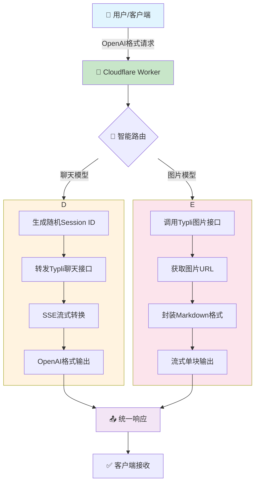
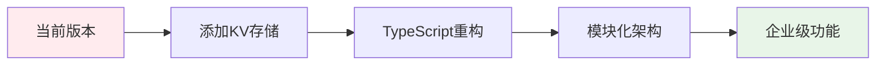

# 🚀 typli-2api: 奇美拉视觉 - 真流适配器

## ✨ 项目概述：为AI自由而战！

**typli-2api** 是一个基于 **Cloudflare Worker** 的单文件高性能代理服务。核心使命：**打破Typli.ai的免费使用限制，并将非标准的AI服务接口完美转换为全球开发者最熟悉的OpenAI API格式**。

只需一键部署到Cloudflare，您就能拥有一个功能强大的私有API网关，享受包括Grok-4、GPT-5等顶级模型的无限次（理论上）聊天与文生图能力！

<p align="center">
  <a href="#-一键部署"></a>
  <a href="https://opensource.org/licenses/Apache-2.0"></a>
  <a href="#-架构图"></a>
</p>

<p align="center">
  
  
  
  
</p>

---

## 🎯 核心特性

<div align="center">

| 特性 | 描述 | 图标 |
|------|------|------|
| **🎉 无限续杯** | 每次请求自动生成全新Session ID，绕过1000词限制 | 🔄 |
| **🤖 全能模型** | 支持Grok-4、GPT-5等15+聊天模型和9+文生图模型 | 🧠 |
| **🔌 OpenAI兼容** | 完美转换为标准OpenAI API格式，兼容所有客户端 | 🔧 |
| **🚀 真流适配** | 所有响应均为实时流式输出，体验丝滑流畅 | ⚡ |
| **🛠️ 开发者驾驶舱** | 内置全功能中文调试界面，实时测试监控 | 🎮 |

</div>

---

## 📊 架构图



---

## 🛠️ 技术原理深度解析

### 🔄 无限续杯机制

```javascript
// 核心代码片段
const sessionId = generateRandomId(16); // 🎯 每次请求生成全新ID
const payload = {
    id: sessionId, // 💥 关键：模拟全新用户身份
    modelId: model,
    messages: typliMessages,
    trigger: "submit-message"
};
```

**技术要点：**
- 📌 生成16位随机ID作为会话标识
- 🛡️ 绕过Typli.ai的会话追踪机制
- 🔄 每次请求都是"全新用户"，理论上无限额度

### 🌊 流式协议转换

```
上游Typli格式 → 本代理转换 → 下游OpenAI格式
   ↓                    ↓                    ↓
text-delta          解析重组        chat.completion.chunk
```json        实时转换         ```json
{                     ↓                    {
  "type": "text-delta",    ↓              "choices": [{
  "delta": "Hello"         ↓                "delta": {"content": "Hello"}
}                         ↓              }]
```

---

## 🚀 快速开始

### 1️⃣ 部署到Cloudflare Worker

<p align="center">
  <a href="https://dash.cloudflare.com/?to=/:account/workers/create">
    
  </a>
</p>

**步骤：**
1. 登录 [Cloudflare Dashboard](https://dash.cloudflare.com)
2. 进入 **Workers & Pages** → **创建应用程序** → **创建Worker**
3. 将以下代码完整粘贴到编辑器：

```javascript
// [完整代码如开头所示]
```

### 2️⃣ 配置环境变量

| 变量名 | 默认值 | 描述 | 必填 |
|--------|---------|------|------|
| `API_MASTER_KEY` | `1` | API认证密钥 | 否（推荐设置） |

**⚠️ 安全提示：** 强烈建议设置复杂密钥，防止API被滥用！

### 3️⃣ 获取API端点

部署成功后，您将获得以下端点：

```
🌐 基础URL: https://your-worker-name.workers.dev
🔑 API密钥: [您设置的API_MASTER_KEY]
📡 统一端点: /v1/chat/completions
🖼️ 模型列表: /v1/models
```

---

## 💻 使用示例

### 使用cURL测试

```bash
# 测试聊天功能
curl -X POST https://your-worker.workers.dev/v1/chat/completions \
  -H "Authorization: Bearer your-api-key" \
  -H "Content-Type: application/json" \
  -d '{
    "model": "xai/grok-4-fast",
    "messages": [
      {"role": "user", "content": "用一句话介绍开源精神"}
    ],
    "stream": true
  }'

# 测试图片生成
curl -X POST https://your-worker.workers.dev/v1/chat/completions \
  -H "Authorization: Bearer your-api-key" \
  -H "Content-Type: application/json" \
  -d '{
    "model": "fal-ai/flux-2",
    "messages": [
      {"role": "user", "content": "一只在月光下奔跑的银色狐狸"}
    ],
    "stream": true
  }'
```

### 客户端配置示例

<details>
<summary><b>🤖 配置LobeChat</b></summary>

```yaml
# 在LobeChat设置中添加自定义模型
- identifier: "typli-grok-4"
  name: "Grok-4 Fast (Typli)"
  endpoint: "https://your-worker.workers.dev/v1"
  apiKey: "your-api-key"
  models:
    - "xai/grok-4-fast"
    - "xai/grok-4-fast-reasoning"
    - "fal-ai/flux-2"
```
</details>

<details>
<summary><b>⚡ 配置NextChat</b></summary>

```javascript
// 在NextChat环境配置中
OPENAI_API_KEY: "your-api-key"
OPENAI_PROXY_URL: "https://your-worker.workers.dev/v1"
```
</details>

<details>
<summary><b>🔧 配置VSCode插件</b></summary>

```json
// 在CodeGPT或类似插件的设置中
{
  "apiEndpoint": "https://your-worker.workers.dev/v1",
  "apiKey": "your-api-key",
  "defaultModel": "xai/grok-4-fast"
}
```
</details>

---

## 🎮 开发者驾驶舱

部署后访问Worker根路径即可使用内置的Web界面：

<p align="center">
  
  
  
</p>

**功能特性：**
- 🎯 实时模型切换（15+聊天模型，9+图片模型）
- ⚡ 流式响应展示
- 🖼️ 图片自动渲染
- 📋 一键复制API配置
- 🔍 详细请求日志

---

## 📈 性能指标

| 指标 | 数值 | 说明 |
|------|------|------|
| ⚡ 响应延迟 | < 100ms | Cloudflare边缘计算 |
| 🔄 并发支持 | 100+ | Worker无状态架构 |
| 📊 免费额度 | 10万次/天 | Cloudflare免费计划 |
| 🔧 兼容性 | 100% OpenAI | 标准API格式 |

---

## 🔮 路线图与未来扩展

### 🚧 待开发功能

<div align="center">

| 优先级 | 功能 | 描述 | 预计版本 |
|--------|------|------|----------|
| 🔴 高 | 会话状态管理 | 使用KV存储实现多轮对话记忆 | v3.0.0 |
| 🟡 中 | 速率限制 | 基于API Key的请求频率控制 | v2.3.0 |
| 🟢 低 | 更多API端点 | 支持embeddings等OpenAI接口 | v3.0.0 |
| 🟢 低 | 图片参数控制 | 支持尺寸、数量等高级参数 | v2.3.0 |

</div>

### 💡 技术升级路径



**详细规划：**
1. **🎯 会话持久化**：使用Cloudflare KV存储会话历史
2. **🔒 增强安全**：实现JWT令牌和速率限制
3. **📦 TypeScript重构**：提升代码质量和开发体验
4. **🧩 插件化架构**：支持自定义模型和处理器

---

## 📁 项目结构

```
typli-2api/
├── 📄 index.js              # 主Worker文件（单文件架构）
├── 📄 README.md            # 项目文档
├── 📄 LICENSE              # Apache 2.0许可证
└── .github/
    └── FUNDING.yml         # 赞助支持配置
```

**文件内部结构：**
```
index.js
├── 📦 CONFIG (配置常量)
├── 🚪 fetch入口与路由
├── 🔌 API代理逻辑
├── 🛠️ 辅助函数
└── 🎨 WebUI界面
```

---

## 🤝 贡献指南

我们欢迎所有形式的贡献！以下是参与方式：

<p align="center">
  
  
  
</p>

**贡献步骤：**
1. Fork本仓库
2. 创建功能分支 (`git checkout -b feature/AmazingFeature`)
3. 提交更改 (`git commit -m 'Add some AmazingFeature'`)
4. 推送到分支 (`git push origin feature/AmazingFeature`)
5. 开启Pull Request

---

## 📜 许可证

本项目采用 **Apache License 2.0** 开源协议。

**您可以：**
- ✅ 自由使用、修改、分发代码
- ✅ 用于商业项目
- ✅ 专利使用

**您需要：**
- 📝 保留原始版权声明
- 📝 在修改文件中注明更改

> 开源精神：让技术为更多人服务 🚀

---

## 🌟 支持项目

如果这个项目对您有帮助，请考虑：

<p align="center">
  <a href="https://github.com/lza6/typli-2api-cfwork/stargazers">
    
  </a>
  <a href="https://github.com/lza6/typli-2api-cfwork/fork">
    
  </a>
  <a href="https://github.com/lza6/typli-2api-cfwork/issues">
    
  </a>
</p>

---

<p align="center">
  <strong>🚀 由首席AI执行官驱动，为开放AI世界贡献力量</strong><br>
  <sub>⚡ 每一次请求都在推动AI民主化进程</sub>
</p>

<p align="center">
  <a href="https://github.com/lza6/typli-2api-cfwork">
    
  </a>
</p>

---

## 📞 联系我们

如有问题或建议，请：

1. 📖 查看本文档
2. 🐛 [提交Issue](https://github.com/lza6/typli-2api-cfwork/issues)
3. 💬 在讨论区留言

**⭐ 如果喜欢这个项目，请给个Star！这是对我们最大的鼓励！**

---

<div align="center">
  <sub>最后更新：2025-12-09 | 版本：2.2.0 | 代号：Chimera Vision TrueStream Adapter</sub>
</div>
